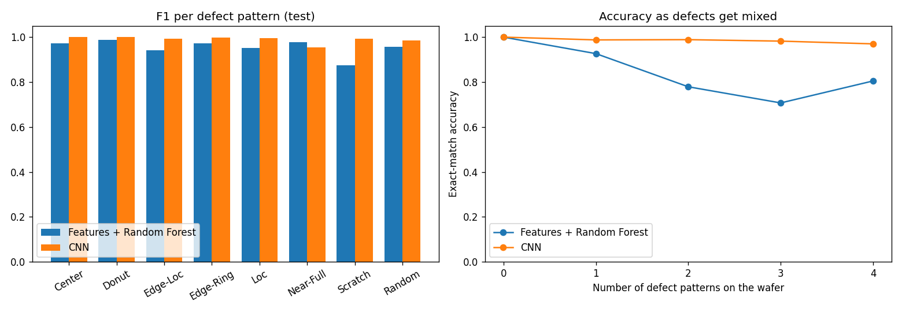
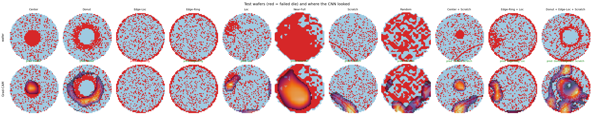

# 🔬 Wafer Defect Pattern Detection

Classifies the **defect patterns on semiconductor wafer maps** — including wafers that show **several patterns at once** — with a CNN, compares it to the classical hand-crafted-feature approach, and explains every prediction with **Grad-CAM** and the likely **manufacturing root cause**.


## Why it matters

After fabrication, every die on a wafer is electrically tested. The **spatial pattern** of failed dies points to what went wrong in the fab: a centre blob suggests a deposition or polishing non-uniformity, a ring points to heating, a line points to a scratch during handling. Recognising these patterns automatically — and when several overlap — speeds up root-cause analysis and yield improvement.

## Data

[**MixedWM38**](https://www.kaggle.com/datasets/co1d7era/mixedtype-wafer-defect-datasets) — 38,015 wafer maps (52×52; 0 = no die, 1 = passed, 2 = failed), each labelled with any of **8 basic patterns**: Center, Donut, Edge-Loc, Edge-Ring, Loc, Near-Full, Scratch, Random — forming **38 classes** (normal, 8 single, 29 mixed with up to 4 patterns).

- **1,024 exact duplicate maps were removed** before splitting, so no wafer appears in both training and test data (36,991 unique maps).
- **Stratified 70 / 15 / 15 split** by label combination: 25,893 train · 5,549 validation · 5,549 test.
- The data is stored as a NumPy `.npz` and loaded with `allow_pickle=False`, so loading it cannot execute code. (The older WM-811K dataset ships as a pickle, which is why it was not used.)

## Approach

| | Baseline | CNN |
|---|---|---|
| Input | **52 hand-crafted spatial features**: defect density per ring and sector, ring profile, edge unevenness, number/size/elongation/position of defect clusters | the raw map as 2 binary channels: *is wafer*, *is failed die* |
| Model | Random Forest (multi-label) | 4 convolutional blocks (32→64→128→128), global average pooling, 8 sigmoid outputs |
| Training | — | BCE loss, AdamW, one-cycle LR, 15 epochs; **random 90° rotations and flips** (a pattern keeps its meaning when the wafer is rotated); best epoch by validation macro-F1 |

Each of the 8 outputs gets its own decision threshold, tuned on the **validation** set; the test set is used once.

## Results (held-out test set, 5,549 wafers)

| Metric | Features + Random Forest | **CNN** |
|---|---|---|
| **Exact match** (all 8 labels right) | 79.2% | **98.5%** |
| Macro-F1 over the 8 patterns | 0.954 | **0.990** |
| Hamming loss | 0.032 | **0.002** |
| Normal wafers wrongly flagged | 0% | **0%** |

**Accuracy as defects get mixed** (exact match):

| Patterns on the wafer | 1 | 2 | 3 | 4 |
|---|---|---|---|---|
| Features + Random Forest | 92.7% | 77.9% | 70.7% | 80.5% |
| **CNN** | **98.8%** | **98.9%** | **98.2%** | **97.0%** |

The hand-crafted features cope with single patterns but break down when patterns overlap; the CNN stays above 97% even with four patterns on one wafer.

**Per pattern (F1):** the biggest gain is on **Scratch** (0.875 → **0.993**) — thin, arbitrarily oriented lines are hard to capture with region-density features but easy for convolutions. The one pattern where the baseline is slightly better is **Near-Full** (0.978 vs 0.955): it is the rarest class (22 test wafers, one miss and one false alarm), and a single "overall defect ratio" feature already separates it well.



## Explainability: where does the CNN look?

Grad-CAM (from the 13×13 convolutional block) highlights the dies that drove each detected pattern. It lands on the defect for centre, donut, local, near-full and scratch patterns, and on each component of mixed wafers. For **edge patterns** the maps are faint — those defects sit on the thin outer rim, where Grad-CAM gives weak signals — so the explanation is least informative there. The gallery also shows an honest error: an Edge-Loc wafer predicted as Edge-Ring (red title).



The app pairs each detected pattern with the typical root cause reported in the wafer-map literature (e.g. *Scratch → mechanical damage during handling or polishing*).

## Limitations

- MixedWM38 was partly **generated with a GAN** to balance the classes (per the dataset description). Exact duplicates were removed, but near-duplicate synthetic maps can still make test scores optimistic compared with a real fab's wafers.
- Root causes are **typical associations**, not a diagnosis; confirming them needs process data.

## Run it

```bash
pip install -r requirements.txt
kaggle datasets download -d co1d7era/mixedtype-wafer-defect-datasets -p data/raw --unzip

python -m wafer.train          # baseline + CNN (≈1.5 h on a laptop CPU; --epochs 2 for a quick run)
python -m wafer.gallery        # Grad-CAM gallery
streamlit run app/app.py       # inspect test wafers, predictions, Grad-CAM and root causes
python -m pytest -q            # tests (need the dataset + trained model)
```

The trained model (`models/cnn.pt`) and per-pattern thresholds are included, so the app runs without retraining.

## Project structure

```text
├── wafer/
│   ├── data.py         # loading, de-duplication, stratified split, labels, root causes
│   ├── features.py     # hand-crafted spatial features (baseline)
│   ├── model.py        # CNN + rotation/flip augmentation
│   ├── train.py        # baseline vs CNN, threshold tuning, evaluation, plots
│   ├── explain.py      # inference + Grad-CAM
│   └── gallery.py      # README figure
├── app/app.py          # Streamlit inspection app
├── models/             # cnn.pt, thresholds.json
├── reports/            # metrics.json, comparison and Grad-CAM figures
└── tests/
```

## Tech stack

Python · PyTorch · scikit-learn · SciPy · NumPy · Matplotlib · Streamlit · pytest
